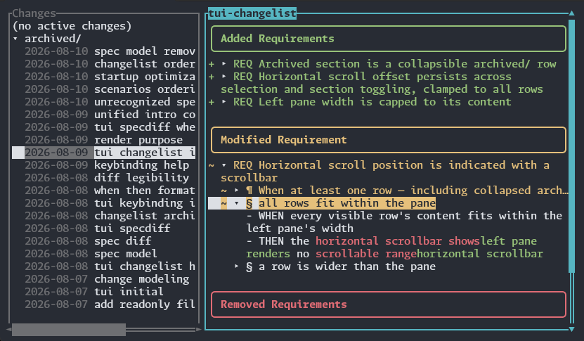

# opsxexplorer

TUI viewer for [OpenSpec] spec diffs.

> [!IMPORTANT]
> Not affiliated with OpenSpec. This is my own, independent project.

## Why?

Each change in OpenSpec creates a few files: a proposal explaining the value of
the change, a design explaining the implementation, a task list, and an updated
version of the relevant capability's spec.

This project helps with the latter of those: the capability's spec.

When OpenSpec creates this spec within the context of a change, the new spec
file represents the _full_ post-change spec: not just its delta. This makes it
cumbersome to review, because the spec conflates what was there before with
what's changing.

Enter opsxexplorer:

You can see:

- Added, modified, renamed, or removed requierments
- Added, modified, or removed scenarios within each requirement
- Additional context about each requirement (introductory text, its reason for
  being removed, etc.)

This is a glorified diff viewer, optimized for OpenSpec's `spec.md` format.
Nothing more.

[OpenSpec]: https://openspec.dev/

## Development

This repo includes a sandboxed [dev container](.devcontainer/README.md) for
running Claude Code. This provides repo-only disk access, and a default-deny
network firewall. See `.devcontainer/README.md` for setup (`just claude` to
start a session).
